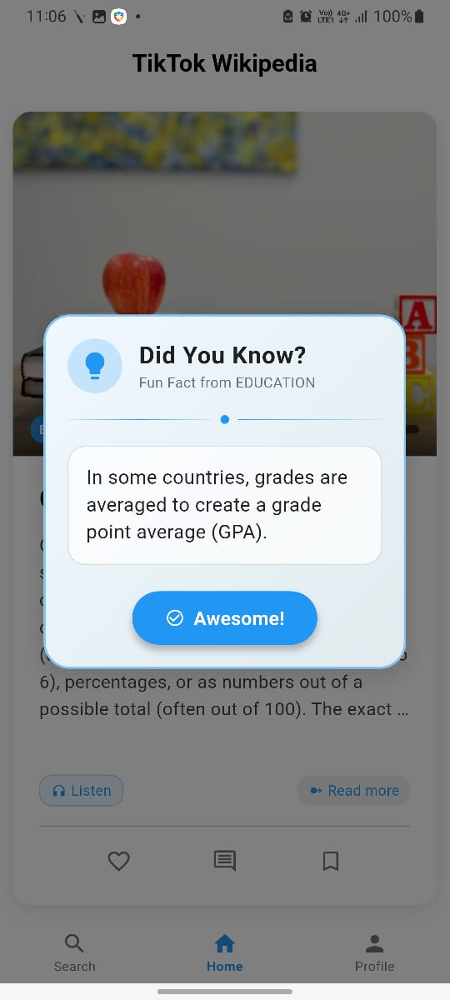
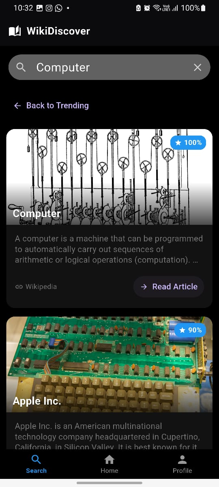
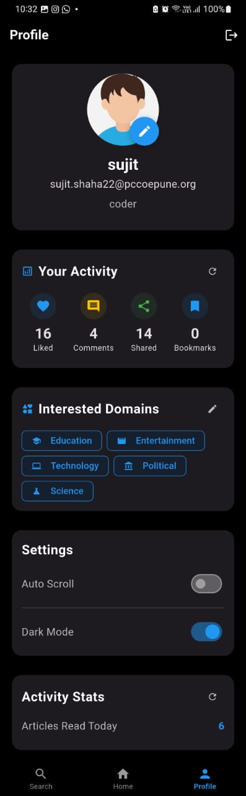
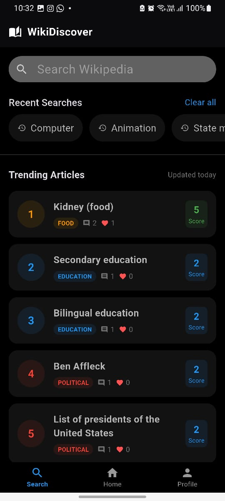

# Wiki-Tok - AI-Enhanced Knowledge Sharing Platform


**Wiki-Tok** is an innovative cross-platform mobile application that combines the power of Wikipedia's vast knowledge base with social media engagement features, creating an immersive and interactive knowledge-sharing experience enhanced by AI.

## 📱 App Demo

<div align="center">
  <div style="background: linear-gradient(135deg, #6e8efb, #a777e3); padding: 20px; border-radius: 12px; box-shadow: 0 8px 20px rgba(0,0,0,0.2); margin: 20px 0;">
    <h3 style="color: white; font-weight: 700; margin-bottom: 15px; text-transform: uppercase; letter-spacing: 1.2px;">✨ WATCH THE DEMO ✨</h3>
    <a href="https://drive.google.com/drive/folders/19Haq7_FkI4E9L8QZbTTBMY3jIJ9xlQws?usp=sharing" target="_blank">
      
    </a>
    <p style="background-color: rgba(255,255,255,0.9); color: #333; font-size: 16px; font-weight: 600; padding: 12px 20px; border-radius: 30px; display: inline-block; margin-top: 15px; box-shadow: 0 4px 8px rgba(0,0,0,0.1);">
      <span style="color: #6e8efb;">▶️</span> <em>Click to experience Wiki-Tok in action!</em> <span style="color: #a777e3;">🔥</span>
    </p>
  </div>
</div>

## 🖼️ UI Showcase

<div align="center">
  <div style="display: flex; flex-wrap: wrap; justify-content: center; gap: 20px;">
    <div style="text-align: center; margin-bottom: 20px;">
      
      <p><strong>Home Feed</strong> - Infinite scrolling with AI-curated content</p>
    </div>
    <div style="text-align: center; margin-bottom: 20px;">
      
      <p><strong>Article Fun Fact Audio</strong> - Immersive Fun Fact and reading experience with audio</p>
    </div>
    <div style="text-align: center; margin-bottom: 20px;">
      
      <p><strong>Search & Explore</strong> - Discover new knowledge</p>
    </div>
    <div style="text-align: center; margin-bottom: 20px;">
      
      <p><strong>User Profile</strong> - Achievements and reading stats</p>
    </div>
    <div style="text-align: center; margin-bottom: 20px;">
      
      <p><strong>Treanding Articles</strong> - Treading Articles on the basis of Likes , Share and Comments</p>
    </div>
  </div>
</div>

## Table of Contents

- [Features](#features)
- [Tech Stack](#tech-stack)
- [Installation](#installation)
- [Project Structure](#project-structure)
- [Modules](#modules)
  - [1. User Interface](#1-user-interface)
  - [2. Backend Services](#2-backend-services)
  - [3. AI & NLP Integration](#3-ai--nlp-integration)
- [Contributing](#contributing)
- [License](#license)
- [Acknowledgments](#acknowledgments)

## Features

- ♾️ **Infinite Scroll** - Seamless browsing experience with continuous content loading
- 💬 **Interactive Comments** - Public comment system on all posts with user profile integration
- 🔍 **Wikipedia Integration** - Global search capability for accessing Wikipedia information
- 🔥 **Trending Posts** - Algorithm-based trending content featuring most liked, commented, and shared posts
- 🌓 **Customizable Themes** - Toggle between dark and light modes for personalized viewing experience
- 📜 **Auto-Scroll** - Customizable auto-scrolling feature with user-defined time intervals
- 🏆 **Gamification System** - Achievement badges for reading and sharing milestones displayed on user profiles
- 📰 **Article Reader** - Comprehensive article viewing with detailed content access
- 🔊 **Listening the Articles** - Audio playback of articles for accessibility and convenience
- 👆 **Fun-Facts** - Quick access to related fun facts with a simple double-tap gesture

## Tech Stack

- **Frontend**: Flutter (Cross-platform development)
- **Backend**: Python with Flask framework
- **Database**: MongoDB (NoSQL database)
- **NLP Engine**: BERT (Bidirectional Encoder Representations from Transformers)
- **API Integration**: RESTful API architecture
- **Authentication**: JWT (JSON Web Tokens)
- **Responsive Design**: Adaptive UI for mobile and tablet

## Installation

### Prerequisites

- Flutter SDK (Latest version)
- Python 3.8+
- MongoDB
- Firebase account (for storage)

### Steps to Set Up

#### 1. Clone the repository:

```bash
git clone https://github.com/ashirwad5555/wiki-tok.git
cd wiki-tok
```

#### 2. Set up backend:

```bash
cd Backend
pip install -r requirements.txt
python app.py
```

#### 3. Set up Flutter frontend:

```bash
# Return to root directory
cd ..
# Get Flutter dependencies
flutter pub get
```

#### 4. Run the Flutter app:

```bash
# Turn on the emulator or connect a physical device before running
flutter run
```

> **Note:** Ensure that you have turned on an Android/iOS emulator or connected a physical device via USB debugging before running the Flutter app.
